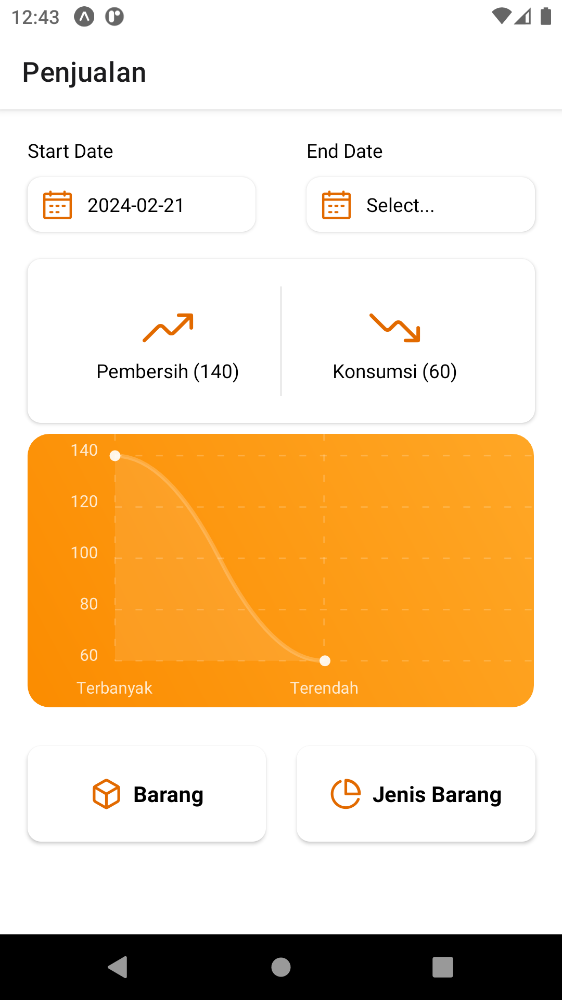
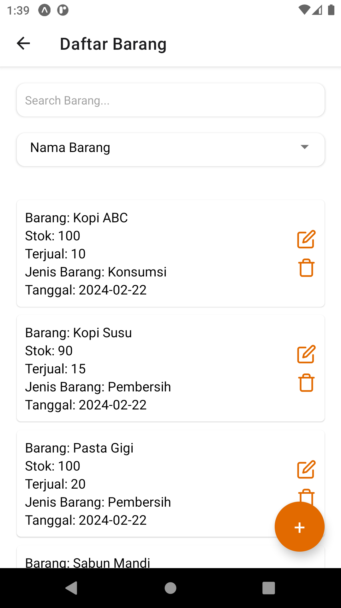
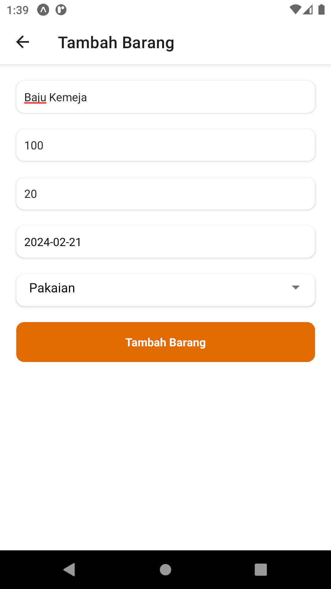
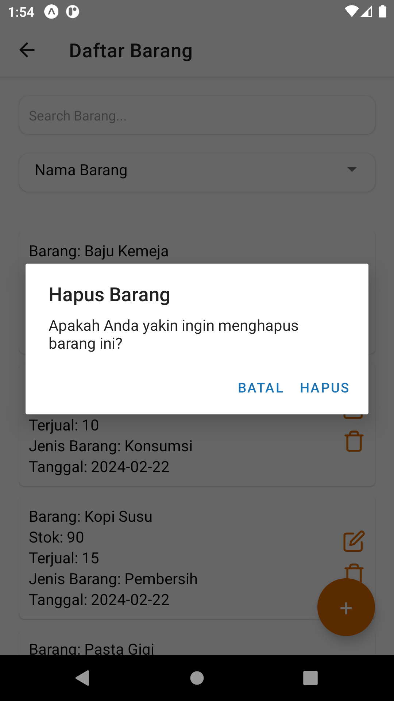
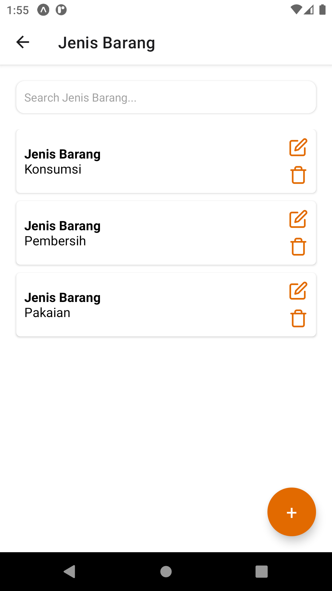
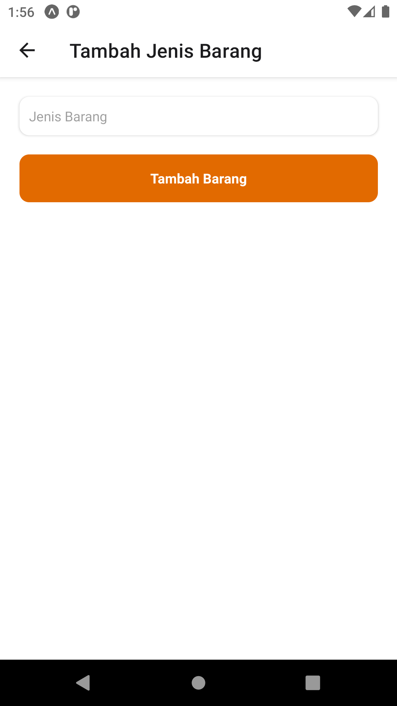

# Welcome to Penjualan App!
Penjualan is frontend for creating Barang, Jenis Barang and see report

## Preview
[](main.png)
[](barang.png)
[](add_barang.png)
[](delete_barang.png)
[](jenis_barang.png)
[](add_jenis_barang.png)

### Currently includes:
- [Demo App](https://drive.google.com/file/d/1hzNHKvV2nQr5tCP03bXSWoxzViF4K6Q4/view?usp=sharing)
- Expo CLI
- React Native
- React Navigation
- TypeScript

### Instalation
```$ git clone https://github.com/M-Julius/FePenjualan-Mobile.git```

```$ cd FePenjualan-Mobile```

```$ yarn install```

```$ npx expo start```

### Feature List:
- [x] Halaman Utama
- [x] Daftar Barang
- [x] Tambah Barang
- [x] Edit Barang
- [x] Hapus Barang
- [x] Daftar Jenis Barang
- [x] Tambah Jenis Barang
- [x] Edit Jenis Barang
- [x] Hapus Jenis Barang  